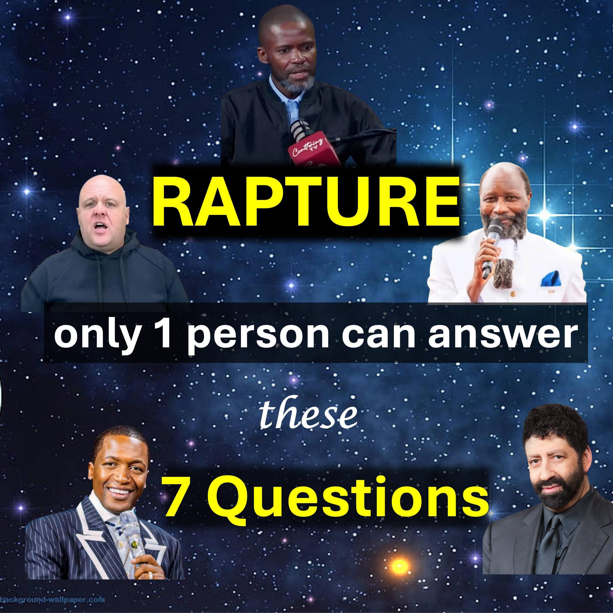

RAPTURE 23/24 September - Only 1 person can answer these 7 questions.  

One - Will some believers sense Jesus’ final approach for the rapture or will it be a surprise to everyone?
Two - Will prophecy about the future continue or will all prophecies stop short of the rapture date?
Three - Does Jesus know the day of the rapture as of now, or will the Father tell him only at the appointed time?
Four - Is it biblical to know the year and the week but not the day or the hour?
Five - Do I subconsciously want more time, before Jesus returns?
Six – If 99 prophecies fail, does it mean the one hundredth prophecy will fail – especially if it is spoken by a different person?
Seven - Is it possible for Satan to appear and one would believe it is Jesus?
Hmmm.
Do you have answers to some or all of these questions?
Do you know someone who does? 
Please help by sharing till we get answers.
Shalom.

#charliekirk #rapture #brojoshua #raptureseptember  #23/24septemberrapture #brandonbiggs #uebertangel #prophetowuor #jonathancahn #donaldtrump

FOLLOW or SUBSCRIBE to LiveAbove3D

Website: www.liveabove3d.com/en/welcome/

YouTube: www.youtube.com/@live.above.3d

TikTok: www.tiktok.com/@live.above.3d

X: www.x.com/live_above_3d

Reddit: www.reddit.com/user/live-above-3d

Instagram: www.instagram.com/live.above.3d

Facebook: www.facebook.com/profile/100092339087423

ABOUT LiveAbove3D

We spread extra dimensional consciousness. The realm of the spirit (or fourth dimension) is right here, right now, all around us.

We are living witnesses/evidence of Yahweh Adonai and his express image: Jesus Christ. Our message (witness/evidence) is primarily for non-Christians.

#LiveAbove3D #samshamoun #dailydoseofwisdom 
#viral #foryou #LiveAbove3D #god #jesus #Apologetics #LoveOfGod  #FaithAndReason #ChristianApologetics #TruthInChristianity #ScienceAndFaith #ChristianityExplained #BelieveInJesus #ReasonsForFaith #EvidenceForGod #UnderstandingChristianity #FaithVsScience #SeekingTruth #LogicAndBelief #Christianity101 #QuestioningAtheism #DebunkingMyths #GodAndScience #DiscoveringFaith #christianliving #blessed #hope #inspiration #BeyondThePhysical #StarTalk #NeildeGrasseTyson

@LiveAbove3D @samshamoun @dailydoseofwisdom 
@Empathetic_Mindfulness @SpaceRewind @technoplusmedia @Cosmoknowledge @themessagechannel1 @CuriositySp @veritasium @kapchatfield.07 @ken.arrington @tedtoks @the.anonymous.prophet @offthekirb @StarTalk @NeildeGrasseTyson

