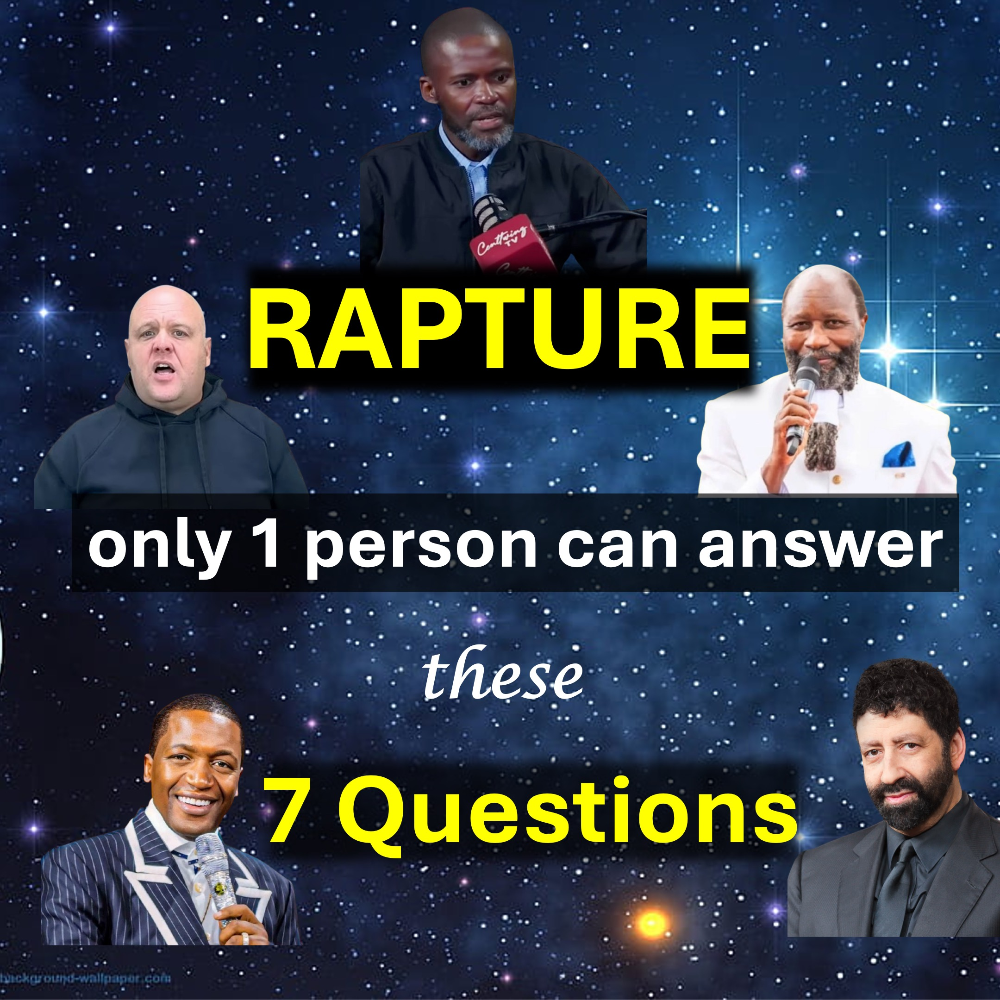

Rapture 23/24 9月 - これらの7つの質問に答えることができるのは1人だけです。

1-信者はイエスの歓喜に対する最終的なアプローチを感じますか、それとも誰にとっても驚きでしょうか？
2-未来についての予言は継続しますか、それともすべての予言が携挙日以外に停止しますか？
3-イエスは今のところ歓喜の日を知っていますか、それとも父親は任命された時間にのみ彼に言うでしょうか？
4-年と週を知るのは聖書的ですが、日や時間を知るのは聖書ですか？
5-イエスが戻る前に、私は無意識のうちにもっと時間を望んでいますか？
6  -  99の予言が失敗した場合、それは特に別の人によって話されている場合、100番目の預言が失敗することを意味しますか？
7-サタンが現れることは可能ですか？
うーん。
これらの質問の一部またはすべてに対する答えはありますか？
あなたは誰か知っていますか？
答えが得られるまで共有して助けてください。
シャローム。

＃charliekirk #rapture #brojoshua #rapturecepteptember＃23/24septemberrapture #brandonbiggs #uebertangel＃jonathancahn #donaldtrump

www.youtube.com/@live.above.3d

tiktok：www.tiktok.com/@live.above.3d

x：www.x.com/live_above_3d

Reddit：www.reddit.com/user/live-above-3d〜 〜

~~ dinstagram Facebook：www.facebook.com/profile/100092339087423

liveabove3d

追加の寸法意識を広げます。 精神の領域（または第4次元）は、今、私たちの周りにここにあります。

私たちは生きている証人/ヤハウェ・アドナイと彼の明示的なイメージの証拠：イエス・キリスト。 私たちのメッセージ（証人/証拠）は主に非キリスト教徒向けです。

＃liveabove3d #samshamoun #dailydoseofwisdom

#viral #foryou＃liveabove3d #god #jesus #apologetics #loveofgod #faithgod #faithgod #faithgod ＃reasonsforfhaith #evidenceforgod #understandingchristianity #faithvsscience #seekingtruth #logicandbelief＃christianity101 #questioningatheism #debunkingmyths

@liveabove3d @samshamoun @dailydoseofwisdom

@empathetic_mindfulness @spacerewind @technoplusmedia @cosmoknowledge @themessagechannel1 @curiositysp @veritasium @kapchatfield.07 @ken.arrington @tedtoks @the.phirbets @StartAlk @neildegrassetyson

