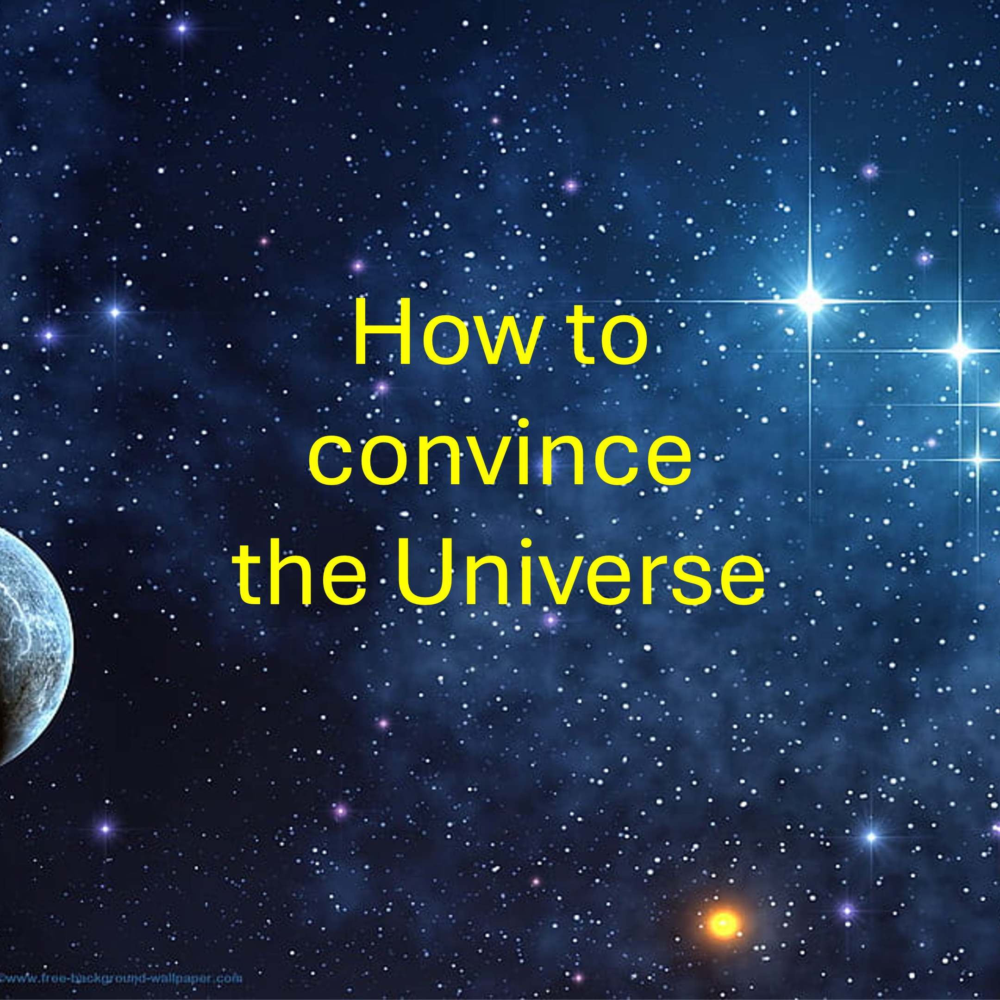

如果你凭着信心（周一）宣告到周五某事将会发生；
你应该不停地祷告，直到你的灵确信某事将会发生。
许多人祷告不停，以致达不到把握的地步。
不管怎样，如果周五之前没有任何变化——就坚持你的话吧。
下面是具体做法。
把你反复说过的话说出来。 一次又一次地循环执行此操作。
每个周期可能持续几周或几个月，甚至几年。
每个周期开始时的每个星期一，
凭信心宣告：“到周五，某事将会发生”。
到第一周（或您使用的任何周期），您就会被说服。
到了第二周，你的家人和朋友就会被说服了。
到了第三周，反对者就会被说服。
到了第四周，鬼子就心服口服了。
到了第五周，圣人们就会服气了。
到了第六周，统治诸域的法则，将被信服。
到了第七周——你就会得到你所说的。
你不仅会拥有你所说的，你还会拥有你所说的一切。
对于在这些事情上已经被说服的人来说，不需要再次被说服。
很多人会开始这个循环，但只有少数人能走到一半。
那些到达一半的人将到达终点并庆祝他们的胜利，荣耀归于父神。
沙洛姆。

#pray #faith #speak #conviction #victory #universe # believe

关注或订阅 LiveAbove3D

网站：www.liveabove3d.com/en/welcome/

YouTube：www.youtube.com/@live.above.3d

TikTok：www.tiktok.com/@live.above.3d

X： www.x.com/live_above_3d

Reddit：www.reddit.com/user/live-above-3d

Instagram：www.instagram.com/live.above.3d

Facebook：www.facebook.com/profile/100092339087423

关于LiveAbove3D

我们传播超维度意识。 精神领域（或第四维度）就在此时此地，就在我们周围。

我们是耶和华阿多奈和他的形象：耶稣基督的活见证人/证据。 我们的信息（见证/证据）主要是针对非基督徒的。

#LiveAbove3D #samshamoun #dailydoseofwisdom
#viral #foryou #LiveAbove3D #god #jesus #Apologetics #LoveOfGod #FaithAndReason #ChristianApologetics #TruthInChristianity #ScienceAndFaith #ChristianityExplained #BelieveInJesus #ReasonsForFaith #EvidenceForGod #UnderstandingChristianity #FaithVsScience #SeekingTruth #LogicAndBelief #Christianity101 #QuestioningAtheism #DebunkingMyths #GodAndScience #DiscoveringFaith #christianliving #blessed #hope #inspiration #BeyondThePhysical #StarTalk #NeildeGrasseTyson

@LiveAbove3D @samshamoun @dailydoseofwisdom
@Empathetic_Mindativity @SpaceRewind @technoplusmedia @Cosmoknowledge @themessagechannel1 @CuriositySp @veritasium @kapchatfield.07 @ken.arrington @tedtoks @the.anonymous.prophet @offthekirb @StarTalk @NeildeGrasseTyson