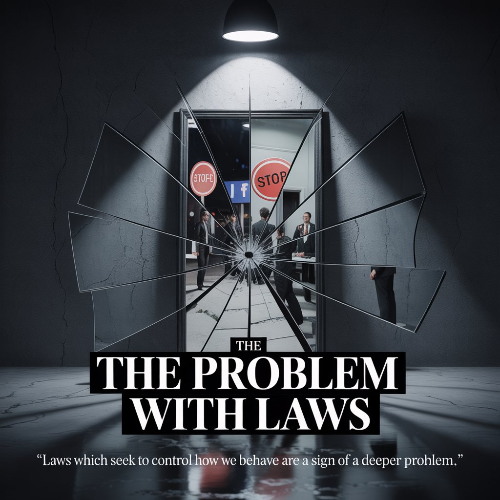

আমরা কিভাবে আচরণ করি তা নিয়ন্ত্রণ করে এমন আইনগুলি কিছু সমস্যার লক্ষণ।
উদাহরণস্বরূপ, পিতামাতা এবং সন্তানদের সাথে একটি সাধারণ পরিবারে,
পিতামাতারা আইন করতে পারেন, "ভিডিও গেম খেলার আগে আপনার বাড়ির কাজ করুন"।
যাইহোক, পিতামাতারা আইন করে না যেমন: "তোমার মাকে হত্যা করো না"।
তাহলে দেশগুলো কেন এমন আইন করে?
কেন ঈশ্বর ইস্রায়েলীয়দের এই আইন দিয়েছিলেন যে: "তোমরা হত্যা করবে না"?
হুমম।
10টি আদেশের প্রয়োজনের জন্য কিছু গুরুতর সমস্যা ছিল।
একইভাবে, দেশে অনেক আইন আছে, যে আধ্যাত্মিক দৃষ্টিকোণ থেকে, মানুষের সাথে কিছু সত্যিই বড় সমস্যা আছে।
যীশু খ্রীষ্ট কেন এসেছিলেন সেই সমস্যা।
বাইবেল রেকর্ড করে যে যারা যীশু খ্রীষ্টে বিশ্বাস করে তারা তাদের পুরানো ব্যক্তিকে ত্যাগ করেছে যেটি কলুষিত ছিল,
এবং একটি নতুন ব্যক্তিকে পরিধান করেছে যা ঈশ্বরের পরে পবিত্রতায় সৃষ্ট হয়েছে।
যখন বাইবেল বলে যে আমরা আইনের অধীনে নই,
এর অর্থ এই নয় যে আমাদের চুরি বা হত্যা করার অনুমতি দেওয়া হয়েছে।
বরং, একটি সাধারণ মানব পরিবারের মতো আইনের প্রয়োজন নেই: "হত্যা করবেন না"।
যিহোবার পবিত্র পরিবারের কোন আইনের প্রয়োজন নেই।
এটা কি বোধগম্য হতে শুরু করেছে?

বাইবেলের আয়াত

যে বৃদ্ধ লোকটির পূর্বের কথোপকথন সম্পর্কে আপনি স্থগিত করেছেন, যে প্রতারক লালসা অনুসারে কলুষিত;
এবং আপনার মনের চেতনায় পুনর্নবীকরণ করুন;
এবং যে আপনি নতুন মানুষ পরিধান, যা ঈশ্বরের পরে ধার্মিকতা এবং সত্য পবিত্রতা সৃষ্টি করা হয়েছে.
Ephesians 4:22-24

কারণ পাপ তোমাদের উপর কর্তৃত্ব করবে না, কারণ তোমরা আইনের অধীন নও, কিন্তু অনুগ্রহের অধীন৷
তাহলে কি? আমরা কি পাপ করব, কারণ আমরা বিধি-ব্যবস্থার অধীন নই, কিন্তু অনুগ্রহের অধীন? ঈশ্বর না করুন।
রোমানস 6:14-15

অনুসরণ করুন বা LiveAbove3D-এ সাবস্ক্রাইব করুন

ওয়েবসাইট: www.liveabove3d.com/en/welcome/

YouTube: www.youtube.com/@live.above.3d

TikTok: www.tiktok: www.~live3D. www.x.com/live_above_3d

Reddit: www.reddit.com/user/live-above-3d

Instagram: www.instagram.com/live.above.3d

Facebook: www.facebook.com/profile/100092339087423 আমরা লাইভ মাত্রিক চেতনা। আত্মার রাজ্য (বা চতুর্থ মাত্রা) এখানে, এই মুহূর্তে, আমাদের চারপাশে।

আমরা যিহোবা অ্যাডনাই এবং তার প্রকাশ মূর্তি: যীশু খ্রীষ্টের জীবন্ত সাক্ষী/প্রমাণ। আমাদের বার্তা (সাক্ষী/প্রমাণ) প্রাথমিকভাবে অ-খ্রিস্টানদের জন্য।

#LiveAbove3D #samshamoun #dailydoseofwisdom

#viral #foryou #LiveAbove3D #god #jesus #Apologetics #LoveOfGod #FaithAndReason #ChristianApologetics #TruthInChristianity #Scilianity #BelieveInJesus #ReasonsForFaith #EvidenceForGod #UnderstandingChristianity #FaithVsScience #SeekingTruth #LogicAndBelief #Christianity101 #QuestioningAtheism #DebunkingMyths #GodAndScience #DebunkingMyths #GodAndScience #DebunkingMyths #Inspiration #BeyondThephysical #StarTalk #NeildeGrasseTyson

@LiveAbove3D @samshamoun @dailydoseofwisdom

@Empathetic_Mindfulness @SpaceRewind @technoplusmedia @Cosmoknowledge @themesschanel1 @kapchatfield.07 @ken.arrington @tedtoks @the.anonymous.prophet @offthekirb @StarTalk @NeildeGrasseTyson

