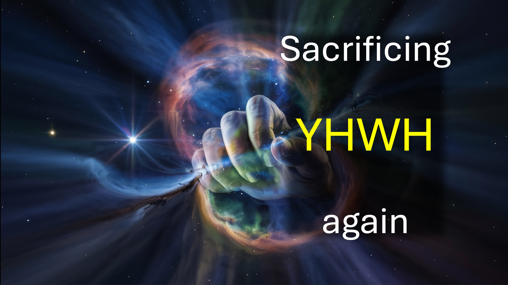

Impareremo la cosa principale che devi sapere: vincere il male.

Hmm.

I predicatori spesso predicano che il tuo alter (e il suo sacrificio) deve essere più grande di quello del nemico.

Fortunatamente hai già l'alter più grande,

su cui è stato fatto il sacrificio più grande.

Yahweh Adonai (creatore di tutte le cose visibili e invisibili) è stato sacrificato per te.

Cos'altro ti serve?

Non c'è da stupirsi che Gesù abbia detto:

“Ti do il potere, su tutto il potere del nemico”.

Non hai accettato quel potere?

Come facciamo a sapere che hai quel potere, se non lo usi?

Come facciamo a sapere che hai quel potere, se passi molto tempo a preoccuparti o a pregare per te stesso?

Fai questo invece.

Uno: Chiedi a Dio di mostrarti il ​​futuro che ha preparato per te.

Due: Riorganizza la tua vita attorno a quel futuro.

Tre - Allora ti ritroverai a usare il potere di Dio.

Ricorda; hai potere, su tutto il potere del nemico.

Shalom.

#superare #alter #sacrificio #YHWH #Gesù #potenza #pregare

VERSO DELLA BIBBIA

Ecco, io ti do il potere di camminare su serpenti e scorpioni e su tutta la potenza del nemico: e nulla potrà in alcun modo farti del male. - Luca 10:19

SEGUI o ISCRIVITI a LiveAbove3D

Sito web: www.liveabove3d.com/en/welcome/

YouTube: www.youtube.com/@live.above.3d

TikTok: www.tiktok.com/@live.above.3d

X: www.x.com/live_above_3d

Reddit: www.reddit.com/user/live-above-3d

Instagram: www.instagram.com/live.above.3d

Facebook: www.facebook.com/profile/100092339087423

INFORMAZIONI su LiveAbove3D

Diffondiamo la coscienza extra dimensionale. Il regno dello spirito (o quarta dimensione) è proprio qui, proprio ora, intorno a noi.

Dimostriamo/testimoniamo DIO (YHWH) con l'autorità di Gesù Cristo e il potere dello Spirito Santo. Il nostro messaggio è principalmente per i non cristiani.

#LiveAbove3D #samshamoun #dailydoseofwisdom
#viral #foryou #LiveAbove3D #god #jesus #Apologetics #LoveOfGod #FaithAndReason #ChristianApologetics #TruthInChristianity #ScienceAndFaith #ChristianityExplained #BelieveInJesus #ReasonsForFaith #EvidenceForGod #UnderstandingChristianity #FaithVsScience #SeekingTruth #LogicAndBelief #Christianity101 #QuestioningAtheism #DebunkingMyths #GodAndScience #DiscoveringFaith #christianliving #blessed #hope #inspiration #BeyondThePhysical #StarTalk #NeildeGrasseTyson

@LiveAbove3D @samshamoun @dailydoseofwisdom
@Empathetic_Mindfulness @SpaceRewind @technoplusmedia @Cosmoknowledge @themessagechannel1 @CuriositySp @veritasium @kapchatfield.07 @ken.arrington @tedtoks @the.anonymous.prophet @offthekirb @StarTalk @NeildeGrasseTyson