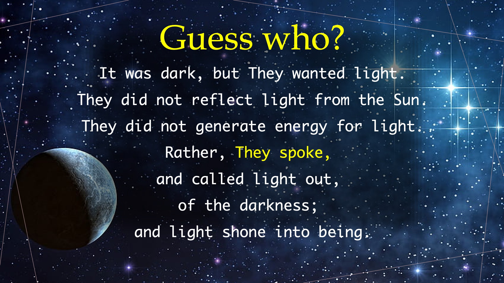

誰だと思いますか？
暗闇でしたが、彼らは光を求めていました。
太陽からの光を反射しませんでした。
光のためのエネルギーを生成しませんでした。
むしろ、彼らは
話し、暗闇から光を呼び起こしました。
そして光が差し込みました。

#JesusChrist #YHWH #light #genesis #words #power

聖書の一節

暗闇から光を放つように命じた神は、私たちの心の中で輝いて、イエス・キリストの御顔に神の栄光の知識の光を与えてくださいました。 - コリント第二 4:6。

LiveAbove3D をフォローまたは購読する

ウェブサイト: www.liveabove3d.com/en/welcome/

YouTube: www.youtube.com/@live.above.3d

TikTok: www.tiktok.com/@live.above.3d

X: www.x.com/live_above_3d

Reddit: www.reddit.com/user/live-above-3d

Instagram: www.instagram.com/live.above.3d

Facebook: www.facebook.com/profile/100092339087423

LiveAbove3D について

私たちは異次元の意識を広めます。 スピリットの領域 (または 4 次元) は、今、ここ、私たちの周りにあります。

私たちはイエス・キリストからの権威と聖霊からの力によって神（YHWH）を証明/証言します。 私たちのメッセージは主に非クリスチャンを対象としています。

#LiveAbove3D #samshamoun #dailydoseofwisdom
#viral #foryou #LiveAbove3D #god #jesus #謝罪 #神の愛 #信仰と理由 #キリスト教の謝罪 #キリスト教の真実 #科学と信仰 #キリスト教の説明 #イエスを信じる #信仰の理由 #神の証拠 #キリスト教の理解 #信仰と科学 #真実の探求 #論理と信念 #キリスト教101 #無神論の疑問 #神話の誤りを暴く #神と科学 #信仰の発見 #クリスチャン生活 #祝福 #希望 #インスピレーション #物理を超えて #スタートーク #ニールデグラッセタイソン

@LiveAbove3D @samshamoun @dailydoseofwisdom
@Empathetic_Mindful @SpaceRewind @technoplusmedia @Cosmoknowledge @themessagechannel1 @CuriositySp @veritasium @kapchatfield.07 @ken.arrington @tedtoks @the.anonymous.prophet @offthekirb @StarTalk @NeildeGrasseTyson