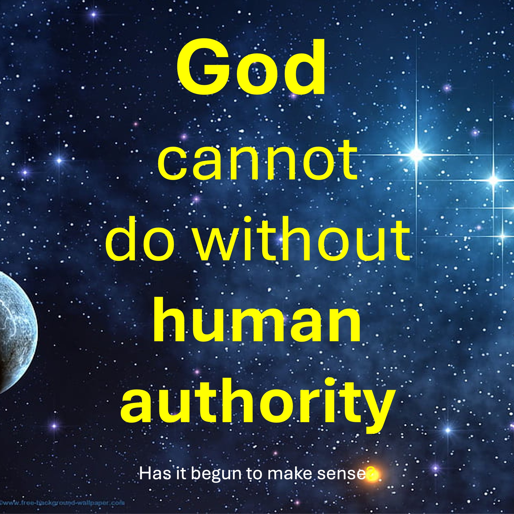

If God is so powerful, why was Lucifer able to attack Him?
Hmmm.
God speaks things into being.
Those things go on to do God’s will using His Spirit and power.
If one of God’s creation goes in the wrong direction,
Another of God’s creation sets the wrong creation right.
When Lucifer rose against God, Michael cast Him out of heaven in God’s name.
Think of this like a video game which you have coded or written.
The video game exists only on your laptop, such that you can delete it with the press of a button.
The characters of the video game are self-aware and know you exist.
The question is: “can any of those characters really attack you”?
Definitely not, because you are truly beyond them.
However, your creations can indirectly attack you, by attacking your other creations.
Here is the interesting thing.
God often uses weaker creations, to keep erring creations in check.
This way we all know that:
In any battle, it is the one who has the Spirit of God that wins.

#YHWH #God #AngelMichael #Lucifer #bytheSpirit

BIBLE VERSE

Then he answered and spake unto me, saying, This is the word of the Lord unto Zerubbabel, saying, Not by might, nor by power, but by my spirit, saith the Lord of hosts.

Zechariah 4:6

FOLLOW or SUBSCRIBE to LiveAbove3D

Website: www.liveabove3d.com/en/welcome/

YouTube: www.youtube.com/@live.above.3d

TikTok: www.tiktok.com/@live.above.3d

X: www.x.com/live_above_3d

Reddit: www.reddit.com/user/live-above-3d

Instagram: www.instagram.com/live.above.3d

Facebook: www.facebook.com/profile/100092339087423

ABOUT LiveAbove3D

We spread extra dimensional consciousness. The realm of the spirit (or fourth dimension) is right here, right now, all around us.

We are living witnesses/evidence of Yahweh Adonai and his express image: Jesus Christ. Our message (witness/evidence) is primarily for non-Christians.

#LiveAbove3D #samshamoun #dailydoseofwisdom 
#viral #foryou #LiveAbove3D #god #jesus #Apologetics #LoveOfGod  #FaithAndReason #ChristianApologetics #TruthInChristianity #ScienceAndFaith #ChristianityExplained #BelieveInJesus #ReasonsForFaith #EvidenceForGod #UnderstandingChristianity #FaithVsScience #SeekingTruth #LogicAndBelief #Christianity101 #QuestioningAtheism #DebunkingMyths #GodAndScience #DiscoveringFaith #christianliving #blessed #hope #inspiration #BeyondThePhysical #StarTalk #NeildeGrasseTyson

@LiveAbove3D @samshamoun @dailydoseofwisdom 
@Empathetic_Mindfulness @SpaceRewind @technoplusmedia @Cosmoknowledge @themessagechannel1 @CuriositySp @veritasium @kapchatfield.07 @ken.arrington @tedtoks @the.anonymous.prophet @offthekirb @StarTalk @NeildeGrasseTyson

