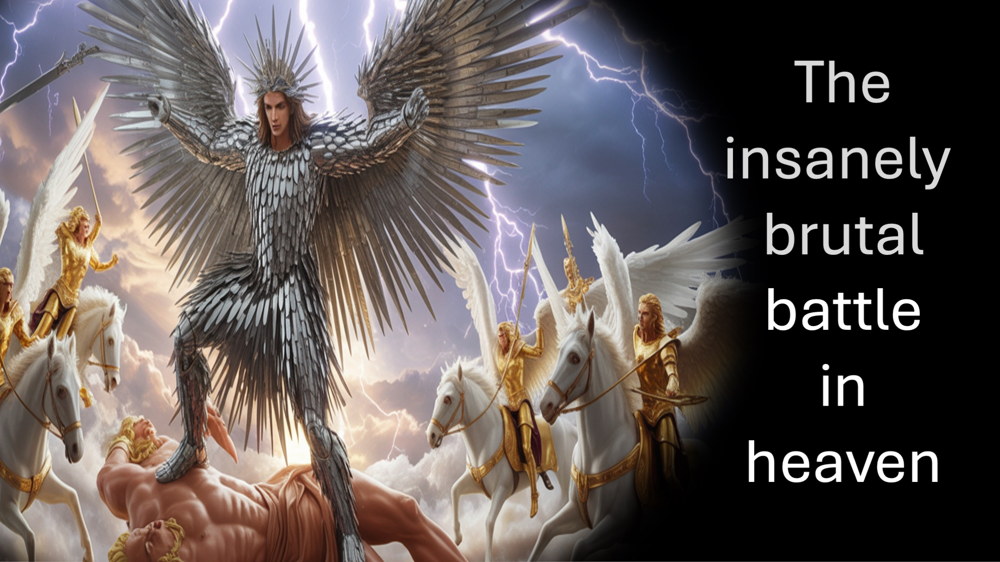

Небо, звезды, даже судьбы – привыкли к войне;
Теперь они все кланяются;
При упоминании имени Иисуса.
Хммм.
Прежде чем звезды начали войну,
Иосиф предсказал, что они поклонятся, сказав:
вот, солнце, луна и одиннадцать звезд поклонились мне.
Бытие 37:9.
Иосиф говорил о себе - он был прообразом Иисуса.
Позже мы видим, как звезды сражаются с небес;
со своих курсов они воевали против Сисары.
Судей 5:20.
Но есть и хорошие новости.
Иисус не воспользовался Своим равенством с Богом.
Скорее Он смирил Себя даже до смерти.
Посему Бог превознес Его,
и даровал Ему имя, которое выше всякого имени.
Чтобы пред именем Иисуса
КАЖДОЕ КОЛЕНО Склонилось
тех, кто на небесах, на земле и под землёй,
и чтобы КАЖДЫЙ ЯЗЫК ПРИЗНАЛ
, что Иисус Христос есть ЯХВЕ,
во славу Бога Отца.
Филиппийцам 2:9-11.
Вот что это значит.
Всякий раз, когда я занимаю место Его,
который занял место меня,
каждое колено преклоняется.
и всякий язык клянётся,
, что Иисус есть ЯХВЕ,
во славу Бога Отца.
Это начало обретать смысл?

#Иисус #ЯХВЕ #Христос #имяИисуса #небеса #война

БИБЛЕЙСКИЕ СТИХИ

Судей 5:20, Бытие 37:9 и Филиппийцам 2:9-11

Звезды сражались с неба;
Со своих курсов они воевали против Сисары.
Судей 5:20 (LSB)

Тогда приснился ему еще другой сон, и он рассказал его братьям своим и сказал: «Вот, приснился мне еще другой сон: и вот, солнце, луна и одиннадцать звезд склонились ко мне».
Бытие 37:9 (LSB)

Поэтому и Бог превознес Его и даровал Ему имя выше всякого имени, чтобы перед именем Иисуса преклонилось всякое колено у тех, кто на небе, на земле и под землёй, и чтобы КАЖДЫЙ ЯЗЫК ИСПОВЕДОВАЛ, что Иисус Христос есть ЯХВЕ, во славу Бога Отца.
Филиппийцам 2:9-11 (LSB)

СЛЕДУЙТЕ или ПОДПИШИТЕСЬ на LiveAbove3D

Веб-сайт: www.liveabove3d.com/en/welcome/

YouTube: www.youtube.com/@live.above.3d

TikTok: www.tiktok.com/@live.above.3d

X: www.x.com/live_above_3d

Reddit: www.reddit.com/user/live-above-3d

Instagram: www.instagram.com/live.above.3d

Facebook: www.facebook.com/profile/100092339087423

О LiveAbove3D

Мы распространяем сверхпространственное сознание. Царство духа (или четвертого измерения) находится прямо здесь, прямо сейчас, повсюду вокруг нас.

Мы доказываем/свидетельствуем о Боге (ЯХВЕ) с властью Иисуса Христа и силой Святого Духа. Наше послание адресовано прежде всего нехристианам.

#LiveAbove3D #samshamoun #dailydoseofwisdom
#viral #foryou #LiveAbove3D #god #jesus #Apologetics #LoveOfGod #FaithAndReason #ChristianApologetics #TruthInChristianity #ScienceAndFaith #ChristianityExplained #BelieveInJesus #ПричиныВеры #ДоказательстваДляБога #ПониманиеХристианства #ВераПротивНауки #В поисках Истины #ЛогикаИВера #Christianity101 #ВопросыАтеизма #РазоблачениеМифов #БогИНаука #ОткрытиеВеры #christianliving #blessed #hope #inspiration #BeyondThePhysical #StarTalk #NeildeGrasseTyson

@LiveAbove3D @samshamoun @dailydoseofwisdom
@Empathetic_Mindfulness @SpaceRewind @technoplusmedia @Cosmoknowledge @themessagechannel1 @CuriositySp @veritasium @kapchatfield.07 @ken.arrington @tedtoks @the.anonymous.prophet @offthekirb @StarTalk @NeildeGrasseTyson

