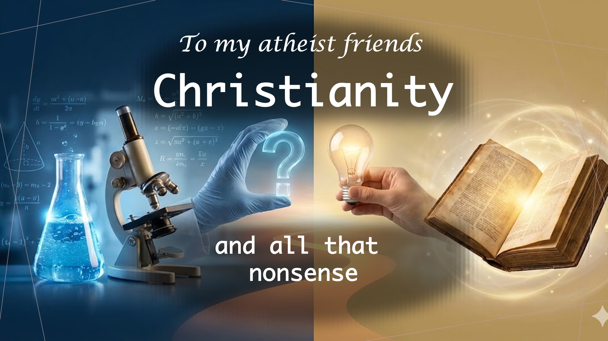

地上には神の証拠があります。
これは、具体的で明確な証拠が必要な非常に重大な主張です。
証拠をお見せします
しかし、その前に、この思考実験で
証拠の性質を理解してもらいましょう。

5 日前に亡くなった少女の墓の前に立っている男性が
少女を生き返らせると呼び掛けると、少女は生き返ります。
するとその男は、神の名の下にそれをしたと言いました。
神の存在と愛を証明するにはそれだけで十分でしょうか？

覚えておいてください、私たちはキリスト教について話しているのではありません。
むしろ、私たちは仮定の質問をしているのですが、もしその単一の行為が私たちが説明したように起こったとしたら、
それは神の存在と愛を証明するのに十分でしょうか?

あなたの答えは何ですか?
その考えを抱いてください。
私が説明したように、過去 70 年間に一度だけ、死者が生き返ったとしたらどうなるでしょうか?
この一貫性（または再現性）の欠如は、神が存在しないことを意味するのでしょうか？ 〜〜〜うーん。
私が尋ねるのは、科学において、結果が 2% の確率でしか再現できないとしても、
それは奇跡ではなく、何か別の説明があるはずだからです。

さらに詳しく見てみましょう。
キリスト教徒が 100 人に 1 人だけが病人を癒したり、悪魔を追い出したり、イエスが信者が行うだろうと述べたようなことを行うとしたら、

これは成功率が 1 パーセントであることを意味しますか?
それとも成功率が 100 パーセントであることを意味しますか?
プロセスを設計した人
は、このプロセスは 1 つの単純な要素、つまり信仰によって実行されるたびに成功すると言いました。

悲しいことに、クリスチャンは必要な材料を使わずにこのプロセスを試みることがよくありますが、
他の人は、クリスチャンの生活が神のような力を示さないのを見て、
神などいないと結論づけます。
ここに知恵があります。
一人の人が地上で神の力を一貫して示すことができれば、

そのとき、他の人が何を言おうと何をしようと関係なく、神は存在します。
今日の地球上には、まさにイエスが言われたように、病人を癒したり、死者を生き返らせたりする信者たちがいます。
はい、偽物があります。 しかし、私はすでに、必要なのは一人の真の信者だけであるということを主張しました。 〜〜〜うーん。

やるべきことは次のとおりです。
あなたがまだ無神論者、あるいは未信者、さらにはキリスト教徒であるうちに、この真実を探求することを決意してください。
これは非常に重要です。なぜなら、私たちの創造者が私たちにこの約束を記録したからです。

「あなたが心を込めて私を探すとき、あなたは私を探し、私を見つけるでしょう。」 - エレミヤ 29:13。
あなたの人生で最も重要な決断。
聖書の一節
あなたが心を尽くして私を探すとき、あなたは私を探し、私を見つけるでしょう。 （エレミヤ 29:13）。
しかし、聖霊があなたに臨んだとき、あなたは力を受けるでしょう。 そしてあなたがたはエルサレム、ユダヤとサマリアの全土、そして地の果てに至るまでわたしの証人となるであろう。 (使徒 1:8)

#JesusChrist #isJesusLord #thoughtexperiment #christianity #truth #JesusChrist

LiveAbove3D をフォローまたは購読する

ウェブサイト: www.liveabove3d.com/en/welcome/

YouTube: www.youtube.com/@live.above.3d

TikTok: www.tiktok.com/@live.above.3d

X: www.x.com/live_above_3d

Reddit: www.reddit.com/user/live-above-3d

Instagram: www.instagram.com/live.above.3d

Facebook: www.facebook.com/profile/100092339087423

概要 LiveAbove3D

私たちは異次元の意識を広めます。 スピリットの領域 (または 4 次元) は、今、ここ、私たちの周りにあります。

私たちはイエス・キリストからの権威と聖霊からの力によって神（YHWH）を証明/証言します。 私たちのメッセージは主に非クリスチャンを対象としています。

#LiveAbove3D #samshamoun #dailydoseofwisdom

#viral #foryou #LiveAbove3D #god #jesus #謝罪 #神の愛 #信仰と理由 #キリスト教の謝罪 #キリスト教の真実 #科学と信仰 #キリスト教の説明 #イエスを信じる #信仰の理由 #神の証拠 #キリスト教の理解 #信仰と科学 #真実の探求 #論理と信念 #キリスト教101 #無神論の疑問 #神話の誤りを暴く #神と科学 #信仰の発見 #クリスチャン生活 #祝福 #希望 #インスピレーション #物理を超えて #スタートーク #ニールデグラッセタイソン

@LiveAbove3D @samshamoun @dailydoseofwisdom

@Empathetic_Mindful @SpaceRewind @technoplusmedia @Cosmoknowledge @themessagechannel1 @CuriositySp @veritasium @kapchatfield.07 @ken.arrington @tedtoks @the.anonymous.prophet @offthekirb @StarTalk @NeildeGrasseTyson
