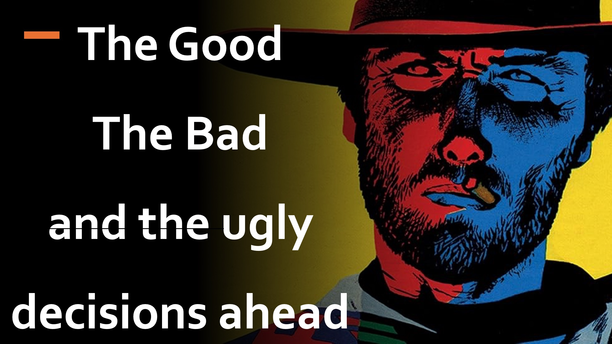

You are the head of the German Army, and you hear that Hitler plans to consolidate power by murdering his opponents.

You know that a tough counter action would be required to stop such a murderous plan.

Your counter action would probably involve killing some of the Hitlers supporters, so it must be worth it; and to be sure, you hesitate.

However, on the other side, Hitler is working to mask his intentions as well as subvert your decision.

You see, unhindered by morals, the Bad have a bias for action, while the Good hesitate by asking:

Will I make things worse by countering the Bad?

How bad will the effects of the Bad’s evil deeds be?

Will countering the Bad make me the new Bad?

Hmm

We begin to see that only the Good who can read the mind of the Bad, as well as see the future, can truly do good, by countering the Bad.

No wonder Mark Chapter 10 verse 18 records that Jesus said: 

“Only God is good”.

LEARN MORE

Website: http://liveabove3d.com

Youtube: https://www.youtube.com/@live.above.3d

Tiktok: https://www.tiktok.com/@live.above.3d

Twitter: @live_above_3d https://twitter.com/live_above_3d

Reddit: live-above-3d https://www.reddit.com/user/live-above-3d

Instagram: https://www.instagram.com/live.above.3d/

Facebook: https://www.facebook.com/profile.php?id=100092339087423

BIBLE VERSES

18 And Jesus said unto him, Why callest thou me good? there is none good but one, that is, God.
Mark 10:18

17 And he said unto him, Why callest thou me good? there is none good but one, that is, God: but if thou wilt enter into life, keep the commandments.
Matthew 19:17

ew 19:17

