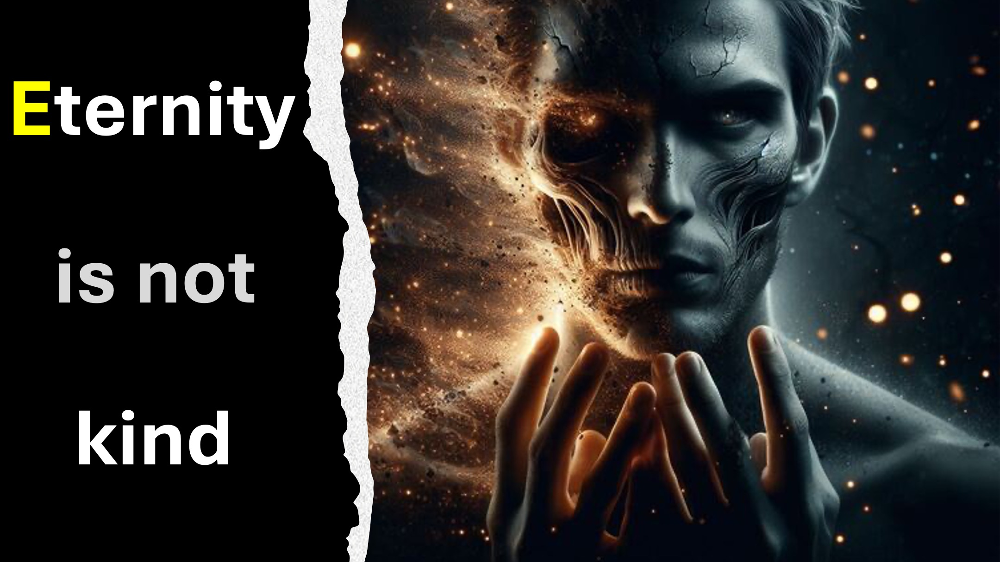

It is the year 3001 AD; you arrive the Elon Musk Center on Mars just in time for the big announcement.

The announcement is no surprise to you; after all you led the team that successfully transferred what you call the human spirit and its soul, from one body to another.

You see, humans had earlier learnt to maintain youth indefinitely.

However, violent death often truncated our quest for everlasting life.

With this breakthrough, death is finally conquered.

Hmm.

Unfortunately, humans must now grapple with a new enemy.

We call this enemy the: “entropy of evil”.

As with entropy, little imperfections proliferate (indeed evil matures) with time.

Humans that cannot die will become increasingly evil - eternally.

Do you know that given enough time, even the slightest deviation from love will fill our reality with hatred and torture.

Just call it hell.

Do you have a solution for this?

LEARN MORE

Website: http://liveabove3d.com

Youtube: https://www.youtube.com/@live.above.3d

Tiktok: https://www.tiktok.com/@live.above.3d

Twitter: @live_above_3d https://twitter.com/live_above_3d

Reddit: live-above-3d https://www.reddit.com/user/live-above-3d

Instagram: https://www.instagram.com/live.above.3d/

Facebook: https://www.facebook.com/profile.php?id=100092339087423
